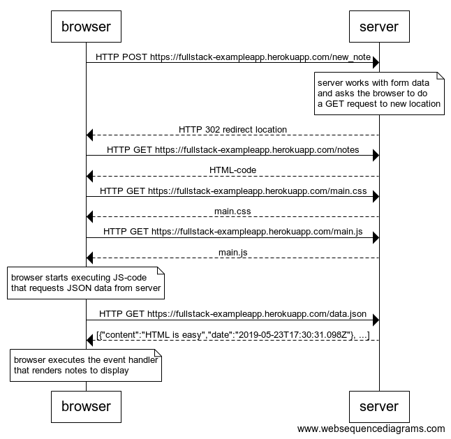
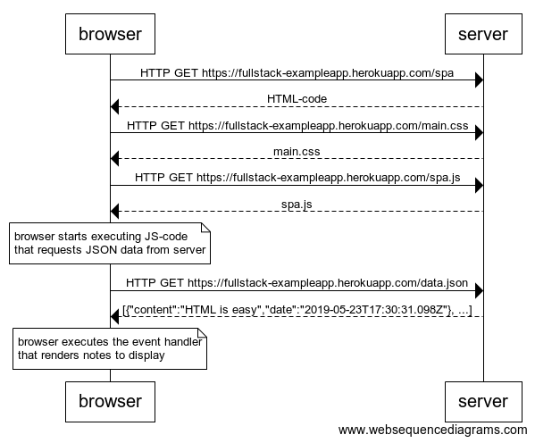
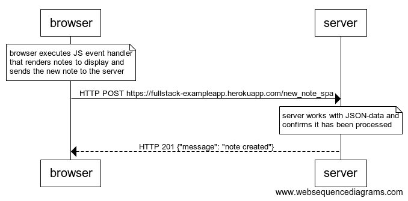

# part 0

## 0.4: new note
The following sequence diagram depicts the situation where the user creates a new note on page https://fullstack-exampleapp.herokuapp.com/notes by writing something into the text field and clicking the submit button as follows:
```
browser->server: HTTP POST https://fullstack-exampleapp.herokuapp.com/new_note
note over server:
server works with form data
and asks the browser to do
a GET request to new location
end note
server-->browser: HTTP 302 redirect location
browser->server: HTTP GET https://fullstack-exampleapp.herokuapp.com/notes
server-->browser: HTML-code
browser->server: HTTP GET https://fullstack-exampleapp.herokuapp.com/main.css
server-->browser: main.css
browser->server: HTTP GET https://fullstack-exampleapp.herokuapp.com/main.js
server-->browser: main.js
note over browser:
browser starts executing JS-code
that requests JSON data from server
end note
browser->server: HTTP GET https://fullstack-exampleapp.herokuapp.com/data.json
server-->browser: [{"content":"HTML is easy","date":"2019-05-23T17:30:31.098Z"}, ...]
note over browser:
browser executes the event handler
that renders notes to display
end note
```


## 0.5: Single page app
The following sequence diagram depicts the situation where the user goes to the single page app version of the notes app at https://fullstack-exampleapp.herokuapp.com/spa as follows:
```
browser->server: HTTP GET https://fullstack-exampleapp.herokuapp.com/spa
server-->browser: HTML-code
browser->server: HTTP GET https://fullstack-exampleapp.herokuapp.com/main.css
server-->browser: main.css
browser->server: HTTP GET https://fullstack-exampleapp.herokuapp.com/spa.js
server-->browser: spa.js
note over browser:
browser starts executing JS-code
that requests JSON data from server
end note
browser->server: HTTP GET https://fullstack-exampleapp.herokuapp.com/data.json
server-->browser: [{"content":"HTML is easy","date":"2019-05-23T17:30:31.098Z"}, ...]
note over browser:
browser executes the event handler
that renders notes to display
end note
```


## 0.6: New note
The following sequence diagram depicts the situation where the user creates a new note using the single page version of the app as follows:
```
note over browser:
browser executes JS event handler
that renders notes to display and
sends the new note to the server
end note
browser->server: HTTP POST https://fullstack-exampleapp.herokuapp.com/new_note_spa
note over server:
server works with JSON-data and
confirms it has been processed
end note
server-->browser: HTTP 201 {"message": "note created"}
```

